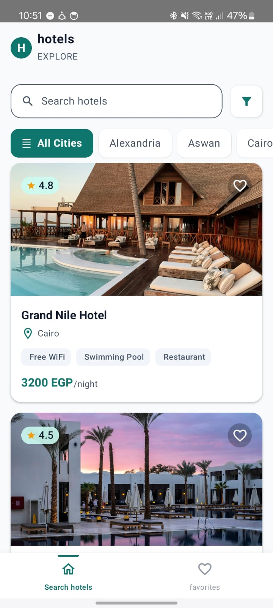
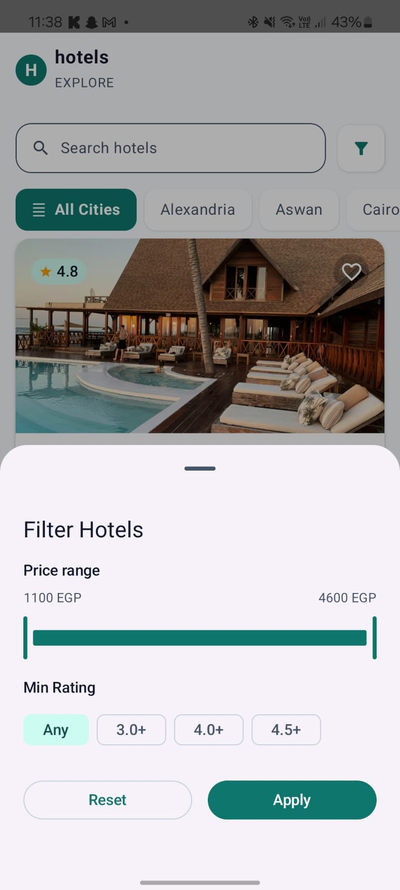
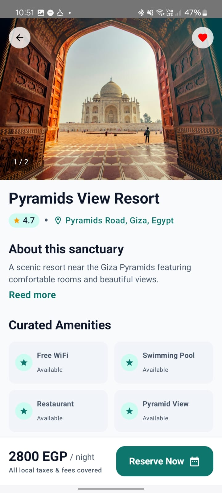
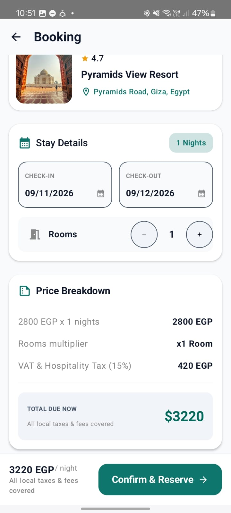
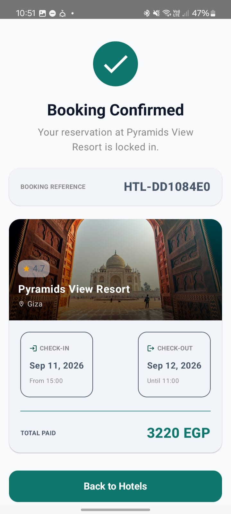
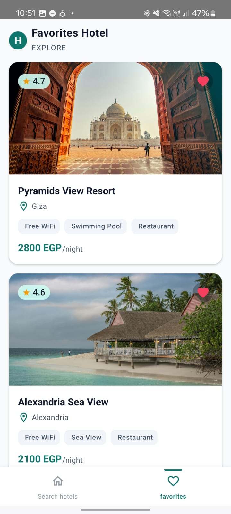

# HotelExplorer 🏨

**HotelExplorer** is a modern, production-grade native Android application for discovering hotels and managing reservations, crafted with Kotlin and Jetpack Compose.

Built from the ground up adhering to **Clean Architecture**, **SOLID Principles**, and **Multi-Module Architecture**, this project showcases clean separation of concerns, reactive state management, Room caching for offline-first capabilities, and end-to-end automated testing.

---
AI usage
## 📱 App Screenshots

| 1. Explore & Search | 2. Filter Sheet | 3. Hotel Details |
| :---: | :---: | :---: |
|  |  |  |
| **4. Booking Details** | **5. Booking Confirmed** | **6. Saved Favorites** |
|  |  |  |

---

## ✨ Key Features

### 🏨 Hotel Discovery & Search
- Browse high-quality curated hotels with imagery, ratings, city, address, and pricing per night.
- Real-time **debounced search** (300ms) by hotel name and city.
- Filter hotels with a modal bottom sheet:
  - Dynamic **Price Range Slider** based on available dataset bounds.
  - **Minimum Rating Filter** (Any, 3.0+, 4.0+, 4.5+).
  - Quick City chips filter.
- **Incremental Pagination** with bottom loading indicators and duplicate prevention.
- Comprehensive UI state handling: `LoadingState`, `EmptyState`, `ErrorState` with retry, and `CachedDataBanner`.

### 🔍 Hotel Details & Amenities
- Multi-image horizontal pager with image indicators and responsive image loading via **Coil**.
- Comprehensive overview: rating badge, description with expandable read more/less toggle, curated amenities, and coordinates.
- Direct booking flow initiation with persistent hotel pricing.

### ❤️ Persistent Favorites
- Add/Remove hotels from favorites on the home list or the details screen.
- **Optimistic UI Updates**: Instant UI reaction with synchronized Room database storage in the background.
- Real-time reactive updates using Kotlin `Flow` and Room DAOs.
- Full offline support and persistence across app restarts.

### 📅 Booking & Price Calculation
- Date selection (Check-in & Check-out) with Material 3 DatePickers.
- Interactive room count stepper with dynamic price multiplication.
- Date validation:
  - Check-in cannot be in the past.
  - Check-out must be after check-in.
- Automatic pricing breakdown:
  - Number of nights calculated via `java.time.temporal.ChronoUnit`.
  - Base price (`nights × rooms × rate`).
  - VAT & Hospitality Tax (15%).
  - Total due now with currency formatting (`EGP`).
- Local confirmation generator with booking reference (`HTL-XXXXXXXX`).
- Shared ViewModel navigation pattern ensuring consistent booking reference and summary across the confirmation flow.

---

## 🏗️ Architecture & Clean Design

HotelExplorer is designed around **Clean Architecture** and **Unidirectional Data Flow (UDF)**:

```text
Presentation Layer (UI / Compose / ViewModels)
                 ↓ (invokes)
Domain Layer (Pure Kotlin: Models / UseCases / Repository Contracts)
                 ↑ (implements)
Data Layer (Room DB / Retrofit + Firebase RTDB / Mappers / Repositories)
```

### Module Structure
The project is modularized into 7 Gradle sub-projects to enforce separation of concerns, improve build times, and maintain loose coupling. The four feature screens (hotels, hotel details, booking, favorites) live as packages inside `app/` rather than as separate Gradle modules, since a dedicated module per screen wasn't worth the build overhead for this project's scope:

```text
HotelExplorer/
├── app/                  # Application host, Navigation Graph, Hilt Application
│   └── features/         # Hotels, HotelDetails, Booking, Favorites — UI & ViewModels (packages, not modules)
├── core/
│   ├── common/           # Pure Kotlin: CoroutineDispatchers, shared Result wrappers
│   ├── database/         # Android Library: Room DB, Entities, DAOs (HotelDao, FavoriteDao)
│   ├── designsystem/     # Design Tokens, Color scheme, Typography, Reusable Composables & strings.xml
│   ├── domain/           # Pure Kotlin: Business Models, UseCases, Repository Interfaces (Zero Android Deps)
│   └── network/          # Retrofit API Service, Moshi DTOs
└── data/                 # Orchestrates Remote & Local sources, Repository Implementations, Mappers
```

### Dependency Direction Rules
- `app` depends on `core:domain`, `core:designsystem`, `core:common`, and `data` directly, since the feature screens now live inside it.
- `core:domain` is pure Kotlin (JVM only), free from Android and Compose dependencies, ensuring 100% fast unit-testability without mocks.
- `data` implements `core:domain` interfaces and manages the synchronization between network DTOs and database entities.

---

## 💾 Caching & Offline-First Strategy

1. **Remote Network Source**:
   - `core:network` fetches hotel data from a live **Firebase Realtime Database** REST endpoint (`.../.json`) via Retrofit, parsing the response through **Moshi**.
2. **Local Room Database**:
   - On app launch, `RefreshHotelsUseCase` queries the remote Firebase source and saves the latest records into SQLite via `HotelDao.insertHotels()`.
3. **Single Source of Truth**:
   - The UI observes Room flows via `HotelRepositoryImpl.getHotels(...)`, ensuring the screen renders cached data instantly even without active network access.
   - If network connectivity fails, the app serves locally cached hotels accompanied by a `CachedDataBanner`.

---

## 🧪 Testing Suite

The project includes an extensive automated test suite covering unit tests and UI integration tests:

### Unit Tests
- **Domain Layer Tests**:
  - `CalculateBookingPriceUseCaseTest`: Verifies nights calculation, room multiplication, 15% VAT, and total price calculation.
  - `ValidateBookingDatesUseCaseTest`: Tests past date rejection, invalid check-out dates, and valid ranges.
  - `ConfirmBookingUseCaseTest`: Validates date validation, pricing integration, and booking reference generation.
- **ViewModel Tests (Presentation Layer)**:
  - `HotelsViewModelTest`: Tests hotel loading, search debounce, and filter state updates with `Turbine` and `StandardTestDispatcher`.
  - `HotelDetailsViewModelTest`: Tests details loading, error handling, and optimistic favorite toggling.
  - `FavoritesViewModelTest`: Tests observing favorites stream and toggling logic.
  - `BookingViewModelTest`: Tests hotel detail loading, date changes, dynamic price recalculation, and confirmation flows.
- **Repository Tests (Data Layer)**:
  - `HotelRepositoryImplTest`: Tests database caching emissions and remote API refresh synchronization.

### Android Instrumented & UI Tests
- **`HotelBookingFlowTest`**:
  - Full end-to-end user journey test (`HotelsScreen` ➔ `HotelDetailsScreen` ➔ `BookingScreen` ➔ `BookingSuccessScreen` ➔ Back to Home).
  - Uses `HiltTestRunner` and `createAndroidComposeRule<MainActivity>()`.

---

## 🛠️ Tech Stack & Libraries

- **Language:** [Kotlin 2.1.20](https://kotlinlang.org/)
- **UI Framework:** [Jetpack Compose](https://developer.android.com/jetpack/compose) with Material 3
- **Dependency Injection:** [Hilt](https://dagger.dev/hilt/) (2.52)
- **Local Database:** [Room](https://developer.android.com/training/data-storage/room) (2.6.1)
- **Networking:** [Retrofit 2](https://square.github.io/retrofit/) & [OkHttp 4](https://square.github.io/okhttp/)
- **Serialization:** [Moshi Kotlin Codegen](https://github.com/square/moshi) (1.15.2) with KSP
- **Image Loading:** [Coil Compose](https://coil-kt.github.io/coil/) (2.7.0)
- **Navigation:** [Jetpack Navigation Compose](https://developer.android.com/guide/navigation) (2.8.0)
- **Testing:** JUnit 4, MockK, Turbine, Google Truth, Espresso, Compose UI Testing

---

## 🚀 Getting Started

### Prerequisites
- Android Studio Ladybug | 2024.2.1 or newer.
- JDK 17.
- Android SDK with minimum API 26 (Android 8.0) and target API 35.

### Installation
1. Clone the repository:
   ```bash
   git clone https://github.com/your-username/HotelExplorer.git
   cd HotelExplorer
   ```
2. Open the project in Android Studio.
3. Sync project with Gradle files.
4. Run the `app` configuration on an emulator or a physical device.

---

## 📦 Running Tests

Execute all Unit Tests across modules:
```bash
./gradlew test
```

Execute Connected Android Instrumentation / UI Tests:
```bash
./gradlew connectedDebugAndroidTest
```

---

## ⚖️ Assumptions & Architectural Decisions

- **Remote Data Source:** Hotel data is served from a live Firebase Realtime Database endpoint over Retrofit/Moshi rather than a local booking backend, since a full booking API was not required for this project's scope.
- **Currency & Formatting:** Amounts are formatted in Egyptian Pounds (`EGP`) with centralized resource strings (`strings.xml`) supporting clean internationalization.
- **Shared Booking State:** Navigation sub-graph (`booking_flow/{hotel_id}`) shares a single ViewModel instance between `BookingScreen` and `BookingSuccessScreen`, eliminating redundant state fetches and ensuring the generated booking reference is preserved.

---

## 🤖 AI Usage

Claude (Anthropic) was used for two things on this project: reviewing the code for bugs and issues, and help with the Android instrumented test (`HotelBookingFlowTest`).

All AI output was reviewed manually before being applied — nothing was committed without understanding what it does and why.

---

## 📌 Future Improvements

- [ ] Integrate a live Remote REST / GraphQL backend with real-time hotel availability.
- [ ] Map view integration (Google Maps / Mapbox) displaying hotel pins and directions.
- [ ] Multi-currency selection and localization (e.g., USD, EUR, EGP, SAR).
- [ ] User authentication and profile-based booking history.
- [ ] Payment gateway integration (Stripe / PayMob).
